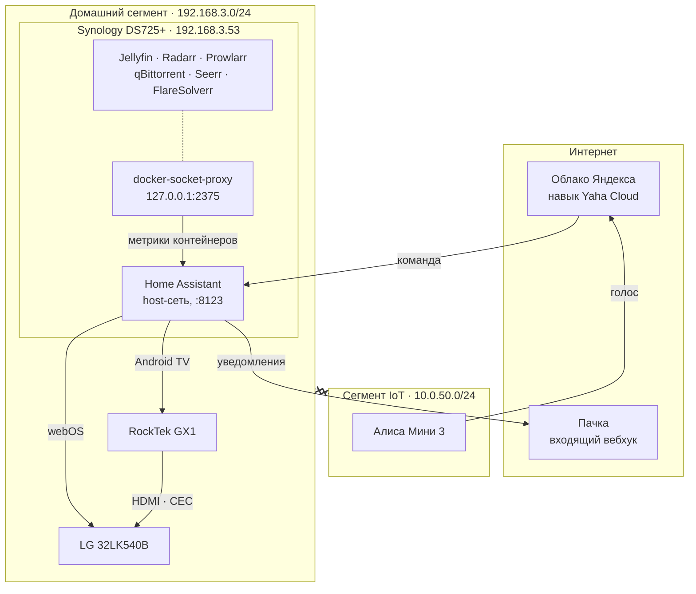

# hh-homelab

Домашний сервер на Synology DS725+: медиа-стек, Home Assistant, уведомления
в Пачку и управление телевизором голосом через Алису — при полностью
изолированных сетевых сегментах.

Репозиторий содержит конфигурацию целиком: два `compose.yaml`, пакеты
Home Assistant, дашборд и подробный чек-лист развёртывания. Секретов здесь
нет — только шаблоны с заглушками.

📋 Два чек-листа с объяснением каждого шага; отметки сохраняются в браузере:

- **[Развёртывание Home Assistant](https://hhypest.github.io/hh-homelab/)** —
  60 шагов: метрики NAS и контейнеров, уведомления, телевизор, Алиса.
  ([`docs/index.html`](docs/index.html))
- **[Настройка медиа-стека](https://hhypest.github.io/hh-homelab/media-stack.html)** —
  37 шагов: папки и хардлинки, qBittorrent, Prowlarr, Radarr, Jellyfin, Seerr.
  ([`docs/media-stack.html`](docs/media-stack.html))

Ссылки заработают после включения GitHub Pages: *Settings → Pages → Source:
Deploy from a branch → main → /docs*.

---

## Что где работает

| | Адрес | Сегмент |
|---|---|---|
| Keenetic Hopper SE (KN-3812) | 192.168.3.1 · 10.0.50.1 | шлюз |
| Synology DS725+ | 192.168.3.53 | Home |
| LG 32LK540BPLA | 192.168.3.52 | Home |
| RockTek GX1 (Google TV) | 192.168.3.54 | Home |
| Яндекс Станция Мини 3 | 10.0.50.50 | IoT |

Сегменты **192.168.3.0/24** и **10.0.50.0/24** изолированы друг от друга,
и эта конфигурация их не нарушает.



Голосовая команда не пересекает границу сегментов: колонка отдаёт её в облако,
облако возвращает в Home Assistant по исходящему соединению NAS.

---

## Структура

```
hh-homelab/
├── media/
│   └── compose.yaml                 медиа-стек: 6 контейнеров
├── homeassistant/
│   ├── compose.yaml                 Home Assistant + docker-socket-proxy
│   ├── dashboard-infrastructure.yaml дашборд, вставляется через интерфейс
│   └── config/
│       ├── configuration.yaml       база, recorder, доверенные прокси
│       ├── secrets.yaml.example     → переименовать в secrets.yaml
│       ├── bin/
│       │   ├── http_check.py        жив ли сервис: HTTP раз в минуту
│       │   └── docker_state.py      жив ли контейнер: Docker API раз в минуту
│       └── packages/
│           ├── docker.yaml          метрики по каждому контейнеру
│           ├── monitoring.yaml      HTTP-проверки, статистика простоя
│           ├── pachca.yaml          уведомления и утренняя сводка
│           ├── media_tv.yaml        телевизор, приставка, сценарии, ночь
│           └── alice.yaml           голосовой отчёт о состоянии сервера
├── docs/
│   ├── index.html                   чек-лист: Home Assistant
│   ├── media-stack.html             чек-лист: медиа-стек
│   └── keenetic.md                  что важно знать про роутер
└── scripts/
    └── validate_config.py           проверка YAML и шаблонов без запуска HA
```

---

## Как разворачивать

Подробно — в [чек-листе](https://hhypest.github.io/hh-homelab/), здесь
короткая версия.

```bash
# 1. Забрать на NAS
cd /volume1/docker
sudo git clone https://github.com/hhypest/hh-homelab.git
cd hh-homelab
sudo chown -R 1026:100 .

# 2. Заполнить секреты
cp homeassistant/config/secrets.yaml.example homeassistant/config/secrets.yaml
sudo chmod 600 homeassistant/config/secrets.yaml
# отредактировать: вебхук Пачки, MAC телевизора, ключ Jellyfin, координаты

# 3. Поднять
sudo docker compose -f media/compose.yaml up -d
cd homeassistant && sudo docker compose up -d
```

**Клон — это и есть рабочая конфигурация, а не её копия.** Каталог
`homeassistant/config` примонтирован в контейнер относительным путём
`./config`, поэтому всё, что Home Assistant пишет в конфигурацию, сразу
попадает в `git status`. Правки в интерфейсе и правки в редакторе живут
в одном месте, и вопрос «какая версия свежее» не возникает.

Медиа-стек оставлен на абсолютных путях (`/volume1/docker/qbittorrent/config`
и так далее): там уже лежат рабочие базы и кэши, и переносить их ради
единообразия — лишний риск без выгоды.

Дальше — по чек-листам: сначала [медиа-стек](docs/media-stack.html)
(папки, хардлинки, связка шести приложений в конвейер), затем
[Home Assistant](docs/index.html) (интеграции, уведомления, телевизор, Алиса).

### Что ставится из HACS

Исходники сторонних компонентов в репозитории не лежат: у каждого свой
репозиторий, своя лицензия и свой цикл обновлений.

| Компонент | Зачем | Обязателен |
|---|---|---|
| [ualex73/monitor_docker](https://github.com/ualex73/monitor_docker) | CPU и память по каждому контейнеру | да, иначе `packages/docker.yaml` не загрузится |
| [dext0r/yandex_smart_home](https://github.com/dext0r/yandex_smart_home) | управление из Умного дома Яндекса | только для Алисы |
| [AlexxIT/YandexStation](https://github.com/AlexxIT/YandexStation) | колонка произносит отчёт о сервере | только для голосового отчёта |

---

## Как это устроено

Несколько решений, которые стоит объяснить, чтобы через полгода не переделать
их обратно «как правильнее».

**Home Assistant работает в сети хоста.** Без этого не работают обнаружение
телевизора по SSDP и Wake-on-LAN: magic-пакет из docker-моста в домашний
сегмент не попадёт. Побочный эффект приятный — до всех сервисов стека можно
достучаться по `127.0.0.1`.

**Сокет Docker не пробрасывается в Home Assistant.** Доступ к
`/var/run/docker.sock` равносилен root на NAS, и флаг `:ro` не спасает: сокет
не файл, права на чтение не мешают слать в него POST. С сокетом разговаривает
только `docker-socket-proxy`, поднятый с `POST=0` и прибитый к петлевому
адресу.

**Метрики и надзор разведены по темпу.** Статистика контейнеров снимается раз
в час: Docker отдаёт её потоком на каждый контейнер, и на двухъядерном R1600
частый опрос — заметная постоянная нагрузка. Состояние проверяется раз в
минуту отдельным дешёвым запросом. Узнавать о падении сервиса через час было
бы бессмысленно, а снимать полную статистику каждую минуту — расточительно.

**Два слоя проверок вместо одного.** Monitor Docker видит контейнер
запущенным даже тогда, когда приложение внутри намертво висит. HTTP-проверки
из `bin/http_check.py` ловят ровно это. Расхождение между двумя списками —
самая полезная информация на дашборде.

**Ночное автоотключение спрашивает, а не решает.** Отличить «смотрю» от «сплю»
по состоянию плеера невозможно — в обоих случаях там `playing`. Автоматизация
ставит паузу и даёт пять минут нажать play: бодрствующий человек нажмёт,
спящий — нет.

**Файл в библиотеке и раздающийся торрент — одни и те же данные.** Radarr
импортирует хардлинком, а не копией: место занято один раз, импорт мгновенный,
раздача не прерывается. Ради этого `/volume1/data` монтируется в qBittorrent
и Radarr одним томом целиком — две отдельные папки сломали бы всю схему,
причём молча.

---

## Безопасность

В репозитории нет ни одного боевого секрета, и CI следит, чтобы так и
оставалось: `scripts/validate_config.py` проверяет каждый закоммиченный файл
на вебхуки Пачки, ключи Jellyfin и MAC-адреса, а `secrets.yaml` перечислен
в `.gitignore`.

Что вычищено намеренно, раз репозиторий публичный: MAC-адреса заменены на
`AA:BB:CC:...`, координаты дома — на центр Москвы, адрес DNS-сервера туннеля и
название VPN-провайдера убраны. Внутренние адреса `192.168.3.x` и `10.0.50.x`
оставлены как есть: они не маршрутизируются из интернета и без них
конфигурация нечитаема.

Если будете форкать — заведите свой `secrets.yaml` и не копируйте
`secrets.yaml.example` под тем же именем в индекс.

---

## Проверка перед коммитом

```bash
pip install pyyaml jinja2 yamllint
yamllint -c .yamllint media homeassistant .github
python3 scripts/validate_config.py
```

Разбирает YAML с тегами Home Assistant, компилирует каждый Jinja-шаблон и
ищет утечки. Ловит незакрытые `` и опечатки в фильтрах — самую частую
причину того, что пакет молча не загружается. Полноценную проверку делает сам
Home Assistant: **Инструменты разработчика → YAML → Проверка конфигурации**.

---

## Железо

**Synology DS725+** — AMD Ryzen R1600, 2 ядра / 4 потока, 2.6–3.1 ГГц,
без встроенной графики. 4 ГБ DDR4 ECC в базе, второй слот свободен.
2 отсека SATA, 2 слота M.2, 1GbE + 2.5GbE.

Отсутствие iGPU означает, что транскодирование в Jellyfin идёт программно на двух
ядрах: один поток 1080p выполним, два уже рвутся, 4K не идёт. Поэтому
приставка GX1 подключена к телевизору напрямую — при прямом воспроизведении
транскод не запускается вовсе.

---

## Лицензия

[MIT](LICENSE). Конфигурация привязана к конкретному железу и сети —
берите как образец, а не как готовое решение.
