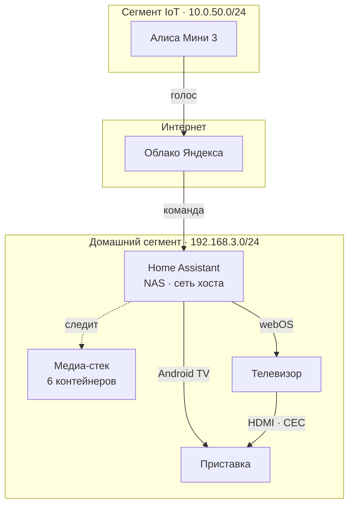

# hh-homelab

[](https://github.com/hhypest/hh-homelab/actions/workflows/validate.yml)
[](https://github.com/hhypest/hh-homelab/releases/latest)
[](LICENSE)
[](LICENSES/CC-BY-4.0.txt)

Домашний сервер на Synology DS725+: медиа-стек, Home Assistant, уведомления
в Пачку и управление телевизором голосом через Алису — при полностью
изолированных сетевых сегментах.

Репозиторий содержит конфигурацию целиком: два `compose.yaml`, пакеты
Home Assistant, дашборд, шаблоны уведомлений, два подробных чек-листа
и гайды по эксплуатации.
Секретов здесь нет — только шаблоны с заглушками.

---

## Документация

Девять документов, каждый отвечает на свой вопрос.

| Документ | Отвечает на вопрос | Формат |
|---|---|---|
| **[Обзор проекта](https://hhypest.github.io/hh-homelab/overview.html)** | Как устроена система целиком, как складывалась, что в ней измерено и нужен ли Prometheus | обзор ([исходник](docs/overview.html)) |
| **[Установка и настройка медиа-стека](https://hhypest.github.io/hh-homelab/media-stack.html)** | Как поднять шесть контейнеров и связать их в конвейер «запрос → фильм в библиотеке» | 47 шагов с отметками ([исходник](docs/media-stack.html)) |
| **[Развёртывание Home Assistant](https://hhypest.github.io/hh-homelab/)** | Как с нуля поднять HA на NAS, снять метрики, настроить уведомления, телевизор и Алису | 63 шага с отметками ([исходник](docs/index.html)) |
| **[Журналы контейнеров](https://hhypest.github.io/hh-homelab/logs.html)** | Почему логи Docker растут без предела, как их ограничить, убрать накопленное и читать | 23 шага с отметками ([исходник](docs/logs.html)) |
| **[Уведомления в Пачку](https://hhypest.github.io/hh-homelab/pachca.html)** | Какой бот в каком чате, где чей шаблон, как настроить каждый сервис | справочник ([исходник](docs/pachca.html)) |
| **[Роутер](https://hhypest.github.io/hh-homelab/keenetic.html)** | Что в настройках Keenetic влияет на этот стек и чего лучше не трогать | заметки ([исходник](docs/keenetic.html)) |
| **[Другие платформы](https://hhypest.github.io/hh-homelab/portability.html)** | Как поднять оба стека не на Synology: что переносится, что переписать в `.env`, где место Terraform и Ansible, реестр решений, зависящих от конкретного железа, и сборка того же стека пакетами Synology вместо Docker | советы ([исходник](docs/portability.html)) |
| **[Дорожная карта](https://hhypest.github.io/hh-homelab/roadmap.html)** | Куда это может расти дальше, в каком порядке и чего решено не делать | 21 пункт с отметками ([исходник](docs/roadmap.html)) |
| **[История версий](https://hhypest.github.io/hh-homelab/changelog.html)** | Что вошло в выпуск, на каких версиях образов проверено, как обновляться | changelog ([исходник](docs/changelog.html)) |

Вся документация — HTML-страницы в одном оформлении; в репозитории остаётся
только этот README. Опубликованы через GitHub Pages из каталога `/docs`,
ссылки в таблице ведут туда. На четырёх страницах — медиа-стек,
Home Assistant, журналы и дорожная карта — отметки сохраняются в браузере,
прогресс виден в боковой панели.

**С чего начинать.** Сначала медиа-стек — он ни от чего не зависит. Потом
Home Assistant: он подключается к уже работающим сервисам. Пачка настраивается
по ходу обоих чек-листов, справочник нужен, когда что-то не сходится.
[Дорожная карта](https://hhypest.github.io/hh-homelab/roadmap.html) пригодится, когда всё заработает
и захочется большего — там же перечислено, что решено **не** делать и почему.

### Куда смотреть, если что-то сломалось

| Симптом | Раздел |
|---|---|
| Фильмы занимают вдвое больше места, чем должны | [медиа-стек, разделы 1 и 9.2](docs/media-stack.html) |
| Radarr ничего не находит | [медиа-стек, раздел 11](docs/media-stack.html) |
| Уведомления перестали приходить | [справочник по Пачке](docs/pachca.html), раздел «Два правила» |
| Нет метрик NAS, пустая температура | [чек-лист HA, раздел 12](docs/index.html) |
| Телевизор не включается голосом | [чек-лист HA, разделы 6.4 и 8.6](docs/index.html) |
| Интернет «залипает» во время загрузок | [медиа-стек, шаг 3.5](docs/media-stack.html) |
| Место на томе кончается, хотя библиотека не росла | [журналы, разделы 3 и 4](docs/logs.html) |

---

## Что где работает

| | Адрес | Сегмент |
|---|---|---|
| Keenetic Hopper SE (KN-3812) | 192.168.3.1 · 10.0.50.1 | шлюз |
| Synology DS725+ | 192.168.3.53 | Home |
| LG 32LK540BPLA | 192.168.3.52 | Home |
| RockTek GX1 (Google TV) | 192.168.3.54 | Home |
| Яндекс Станция Мини 3 | 10.0.50.50 | IoT |

Сегменты **192.168.3.0/24** и **10.0.50.0/24** изолированы друг от друга,
и эта конфигурация их не нарушает.



Голосовая команда не пересекает границу сегментов: колонка отдаёт её в облако,
облако возвращает в Home Assistant по исходящему соединению NAS.

Схема нарочно грубая: телефон вписывает её по ширине экрана, и всё, что
не влезло, становится нечитаемым — подписи размером в три пикселя.
Подробная — с шестью контейнерами, портами, `docker-socket-proxy`
и уведомлениями в Пачку — в
[обзоре проекта](https://hhypest.github.io/hh-homelab/overview.html).

---

## Структура

```
hh-homelab/
├── media/
│   ├── compose.yaml                 медиа-стек: 6 контейнеров
│   ├── .env.example                 → .env: права, пояс, путь, порты
│   ├── config/<сервис>/             состояние и базы — в .gitignore
│   ├── cache/jellyfin/              кэш метаданных — в .gitignore
│   └── watch/                       .torrent на подхват — в .gitignore
├── homeassistant/
│   ├── compose.yaml                 Home Assistant + docker-socket-proxy
│   ├── .env.example                 → .env: часовой пояс и адрес прокси
│   ├── dashboard-infrastructure.yaml дашборд, вставляется через интерфейс
│   └── config/
│       ├── configuration.yaml       база, recorder, Wake-on-LAN, счётчик входов
│       ├── secrets.yaml.example     → переименовать в secrets.yaml
│       ├── bin/
│       │   ├── http_check.py        жив ли сервис: HTTP раз в минуту
│       │   └── docker_state.py      жив ли контейнер: Docker API раз в минуту
│       └── packages/
│           ├── docker.yaml          метрики по каждому контейнеру
│           ├── monitoring.yaml      HTTP-проверки, статистика простоя
│           ├── pachca.yaml          уведомления и утренняя сводка
│           ├── media_tv.yaml        телевизор, приставка, сценарии, ночь
│           └── alice.yaml           голосовой отчёт о состоянии сервера
├── pachca/
│   ├── radarr.liquid                шаблоны уведомлений, по одному на сервис
│   ├── prowlarr.liquid
│   ├── jellyfin.liquid
│   ├── seerr.liquid
│   ├── media-router.liquid          запасной вариант: всё в одного бота
│   │                                (описание — в docs/pachca.html)
│   ├── payloads/                    что шлют Jellyfin и Seerr — задаётся у них
│   └── samples/                     примеры payload для локальной проверки
├── docs/
│   ├── overview.html                обзор: архитектура, история, замеры
│   ├── media-stack.html             чек-лист: медиа-стек
│   ├── index.html                   чек-лист: Home Assistant
│   ├── logs.html                    гайд: журналы контейнеров
│   ├── pachca.html                  справочник: боты, чаты, шаблоны
│   ├── keenetic.html                что важно знать про роутер
│   ├── portability.html             перенос стека не на Synology
│   ├── roadmap.html                 дорожная карта и точки роста
│   └── changelog.html               история версий и порядок обновления
├── scripts/
│   ├── validate_config.py           YAML, Jinja-шаблоны, поиск секретов
│   ├── validate_entities.py         ссылки на сущности и дубликаты
│   ├── validate_docs.py             целостность страниц, ссылки, обезличивание, счётчики
│   ├── render_pachca.py             рендер Liquid-шаблонов на примерах
│   ├── check_ports.py               порты хоста не заняты дважды
│   ├── check_files.py               переводы строк, CRLF, висящие пробелы
│   └── check_image_updates.py       сверка закреплённых тегов с реестром
├── tests/                           pytest для скриптов и шаблонов
├── .github/workflows/
│   ├── validate.yml                 восемь задач проверок на каждый push
│   └── release.yml                  тег и релиз, запускается вручную
├── LICENSE                          MIT — на код
├── LICENSES/CC-BY-4.0.txt           CC BY 4.0 — на текст страниц
├── NOTICE.md                        что под какой лицензией, стороннее ПО, оговорки
└── CONTRIBUTING.md                  на каких условиях принимаются правки
```

---

## Как разворачивать

Пошагово, с проверками и разбором ловушек — в чек-листах; там же отмечается
прогресс. Здесь только маршрут и то, что стоит понимать до начала.

| Что поднимаете | Куда идти |
|---|---|
| Медиа-стек, шесть контейнеров | [чек-лист медиа-стека](https://hhypest.github.io/hh-homelab/media-stack.html), разделы 1–2 |
| Home Assistant и docker-socket-proxy | [чек-лист Home Assistant](https://hhypest.github.io/hh-homelab/), разделы 1–2 |
| Уже подняли — забрать изменения конфигурации | [медиа-стек](https://hhypest.github.io/hh-homelab/media-stack.html), шаг 10.3; [Home Assistant](https://hhypest.github.io/hh-homelab/), шаг 11.4 |

Начинать с медиа-стека: он ни от чего не зависит, а Home Assistant
подключается к уже работающим сервисам.

**Клон — это и есть рабочая конфигурация, а не её копия.** Оба стека
монтируют своё состояние относительными путями, поэтому весь домашний сервер
переносится вместе с репозиторием, а правки видны в `git status` сразу.
Снаружи репозитория осталась только библиотека — `${MEDIA_ROOT}`.
Рабочее дерево git это то, что чистят, а `git clean -xdf` не щадит и
игнорируемое; медиатека такого пережить не должна.
Подробнее, с обоснованием, —
в [обзоре проекта](https://hhypest.github.io/hh-homelab/overview.html),
раздел 5.

> **Одна ошибка стоит вечера.** Каталоги состояния надо создать **до**
> первого запуска. Нет каталога — Docker создаст его сам и от `root`,
> а контейнер с `PUID=1026` писать в него не сможет: приложение падает или
> молча забывает настройки при каждом перезапуске. Выглядит как сломанный
> образ, а дело в правах. Команды — в чек-листах.

### Что ставится из HACS

Исходники сторонних компонентов в репозитории не лежат: у каждого свой
репозиторий, своя лицензия и свой цикл обновлений.

| Компонент | Зачем | Обязателен |
|---|---|---|
| [ualex73/monitor_docker](https://github.com/ualex73/monitor_docker) | CPU и память по каждому контейнеру | да, иначе `packages/docker.yaml` не загрузится |
| [dext0r/yandex_smart_home](https://github.com/dext0r/yandex_smart_home) | управление из Умного дома Яндекса | только для Алисы |
| [AlexxIT/YandexStation](https://github.com/AlexxIT/YandexStation) | колонка произносит отчёт о сервере | только для голосового отчёта |

---

## Как это устроено

Несколько решений, которые стоит объяснить, чтобы через полгода не переделать
их обратно «как правильнее».

**Home Assistant работает в сети хоста.** Без этого не работают обнаружение
телевизора по SSDP и Wake-on-LAN: magic-пакет из docker-моста в домашний
сегмент не попадёт. Побочный эффект приятный — до всех сервисов стека можно
достучаться по `127.0.0.1`.

**Сокет Docker не пробрасывается в Home Assistant.** Доступ к
`/var/run/docker.sock` равносилен root на NAS, и флаг `:ro` не спасает: сокет
не файл, права на чтение не мешают слать в него POST. С сокетом разговаривает
только `docker-socket-proxy`, поднятый с `POST=0` и прибитый к петлевому
адресу.

**Метрики и надзор разведены по темпу.** Статистика контейнеров снимается раз
в час: Docker отдаёт её потоком на каждый контейнер, и на двухъядерном R1600
частый опрос — заметная постоянная нагрузка. Состояние проверяется раз в
минуту отдельным дешёвым запросом. Узнавать о падении сервиса через час было
бы бессмысленно, а снимать полную статистику каждую минуту — расточительно.

**Два слоя проверок вместо одного.** Monitor Docker видит контейнер
запущенным даже тогда, когда приложение внутри намертво висит. HTTP-проверки
из `bin/http_check.py` ловят ровно это. Расхождение между двумя списками —
самая полезная информация на дашборде.

**Ночное автоотключение спрашивает, а не решает.** Отличить «смотрю» от «сплю»
по состоянию плеера невозможно — в обоих случаях там `playing`. Автоматизация
ставит паузу и даёт пять минут нажать play: бодрствующий человек нажмёт,
спящий — нет.

**Уведомления разложены по двум чатам: что смотреть и что чинить.**
В «Кинозале» говорят четыре бота медиа-стека, у каждого свой Liquid-шаблон.
В «Мониторинге» — один бот Home Assistant, и шаблона у него нет: он шлёт
готовый текст. Так вышло не из вкуса, а из устройства Пачки: шаблон задаётся
на боте и применяется ко всем его сообщениям, поэтому одним ботом четыре
разных payload не обслужить.

**Файл в библиотеке и раздающийся торрент — одни и те же данные.** Radarr
импортирует хардлинком, а не копией: место занято один раз, импорт мгновенный,
раздача не прерывается. Ради этого корень библиотеки монтируется в qBittorrent
и Radarr **одним томом целиком** — две отдельные папки сломали бы всю схему,
причём молча. Это требование к форме монтирования, а не к самому пути:
через `MEDIA_ROOT` он настраивается свободно, лишь бы торренты и библиотека
остались на одной файловой системе.

### Настройки — в `.env`, и без них стек не поднимется

Репозиторий публичный, и его поднимают не только на моём NAS. Поэтому всё,
что относится к конкретной машине, вынесено из обоих `compose.yaml` в `.env`
рядом с ними: `PUID`/`PGID`/`UMASK`, часовой пояс, корень библиотеки, адрес
привязки, имя сети Docker и все порты. В репозитории лежат только образцы —
[`media/.env.example`](media/.env.example) и
[`homeassistant/.env.example`](homeassistant/.env.example).

```bash
cd /volume1/docker/hh-homelab
sudo cp media/.env.example media/.env
sudo cp homeassistant/.env.example homeassistant/.env
# дальше выправить под себя: id ваш_логин, свой адрес NAS, свои порты
```

**Значений по умолчанию в compose нет намеренно.** Каждая переменная записана
как `${ИМЯ:?см. .env.example}` — если `.env` забыли, `docker compose up`
падает и называет недостающую переменную. Голое `${ИМЯ}` так не умеет:
Compose подставил бы пустую строку, вернул код 0, и стек поднялся бы
с `PUID=` (то есть root), с UTC вместо своего пояса и **без единого
опубликованного порта**. Снаружи это выглядит как сломанные приложения,
а не как забытый файл — и ищется соответственно долго.

У каждого стека `.env` свой: Compose читает файл из каталога рядом
с `compose.yaml` и в соседние не заглядывает. Поэтому `TZ` указывается
дважды. Это цена того, что стеки остаются двумя независимыми проектами
Container Manager.

### Версии образов закреплены

Все восемь контейнеров стоят на конкретных тегах, а не на `:latest` и
`:stable`. Плавающий тег однажды принёс бы мажорное обновление с изменённым
форматом базы — молча, в момент очередного `docker compose pull`, и сразу
у нескольких сервисов, так что искать виноватого пришлось бы среди всех.

Образов при этом девять, а не восемь: у qBittorrent в `DOCKER_MODS` подключён
VueTorrent — веб-интерфейс вместо штатного. Он тоже закреплён, и по нему
отдельная оговорка ниже.

Обновления вместо этого забираются вручную. Сначала сверка с реестром:

```
python3 scripts/check_image_updates.py
```

Она читает оба compose-файла вместе с `DOCKER_MODS`, ходит в реестр и
говорит, что отстало. Отдельной строкой показывает случаи, где схема
нумерации сменилась и ранжировать машине нельзя, — такое решает человек.
Дальше порядок обратный привычному: поднять теги в `compose.yaml`, прочитать
release notes, смержить, потом `git pull` на NAS, и только потом
`compose pull` с `up -d`. Откат — обычный `git revert`, а не поиск
предыдущего тега по памяти.

> **Почему вручную, а не Dependabot.** Экосистема `docker-compose` стояла
> в `dependabot.yml` две недели и не завела ни одного пул-реквеста, пока
> шесть образов уходили вперёд. Всё проверяемое оказалось верным — имя
> экосистемы, регулярное выражение имён файлов из `dependabot-core`,
> ключи `directory` и `directories`, доступность реестра, наличие свежих
> тегов, собственный валидатор конфига. Причина осталась неизвестной,
> и держать неработающую настройку смысла нет. Разбор —
> в [истории версий](https://hhypest.github.io/hh-homelab/changelog.html).
> Для действий GitHub и пакетов Python Dependabot работает и остался.

Вернуть `:latest` незаметно не выйдет: `tests/test_compose_images.py` роняет
проверки и на плавающем теге, и на образе вовсе без тега, и на compose-файле,
выпавшем из списка сверки, — закрепление без того, кто приносит обновления,
оставило бы вас на версиях того дня, когда его сделали. Проверяются и образы
модов из `DOCKER_MODS`, а не только ключи `image`.

В CI сверки нет намеренно: это поход в сеть наружу, ему не место в проверке
на каждый push. Запускать стоит перед тем, как поднимать версии, и раз
в пару недель просто так.

> **VueTorrent ничем не отличается от остальных.** Мод подключён через
> `DOCKER_MODS`, и скачивается он при **каждом старте контейнера**, а не при
> `compose pull`, — так что с плавающим тегом версия менялась бы даже
> от простого перезапуска, причём `pull` этого не показал бы вовсе. Тег
> зафиксирован, а сверка с реестром читает `DOCKER_MODS` наравне с `image`:
> [vuetorrent/VueTorrent](https://github.com/VueTorrent/VueTorrent/releases).

У Home Assistant нет `PUID`/`PGID`/`UMASK`: официальный образ собран не на
базе linuxserver.io и этих переменных не понимает, он работает от root.
Порт 8123 тоже не в `.env` — контейнер в host-сети, порт задаётся внутри
самого HA.

**Переменная порта двигает только порт хоста.** Со стороны контейнера номера
записаны литералами: Prowlarr слушает 9696, Radarr 7878, Jellyfin 8096 при
любом значении переменной. Иначе публикация указывала бы в пустоту, а адреса
вроде `flaresolverr:8191`, которые вводятся в настройках самих сервисов,
переставали бы совпадать с чек-листом. Исключение одно —
`QBITTORRENT_TORRENT_PORT`: qBittorrent объявляет пирам тот номер, на котором
слушает, и на роутере пробрасывается он же, так что эти три числа обязаны
совпадать.

Одна связка при этом остаётся ручной: Home Assistant опрашивает сервисы по
портам **хоста** (`http://127.0.0.1:<порт>` в `packages/monitoring.yaml`).
Меняете порт в `media/.env` — поправьте и там; расхождение ловит
`tests/test_env_example.py`.

### Почему не Prometheus и Grafana

Вопрос возвращается регулярно, поэтому ответ записан. Коротко: **сейчас нет**,
и не из-за сложности, а потому что задача решается дешевле.

Метрики уже собираются. Monitor Docker даёт CPU и память по каждому
контейнеру, интеграция Synology DSM — температуру, SMART и объём тома,
`docker_state.py` и `http_check.py` проверяют живость раз в минуту. Хранится
это в двух местах: `recorder` держит сырые состояния 21 день, а долговременная
статистика Home Assistant — почасовые минимум, максимум и среднее — **не
удаляется вообще**. Ответить, сколько Jellyfin ел в марте, система сможет
и через год; именно ради этого обычно и ставят отдельную базу метрик.

Единственное, что Prometheus добавил бы по существу, — разрешение по времени.
И вот тут арифметика решает вопрос:

| Вариант | Шаг | Точек в сутки | Цена |
|---|---|---|---|
| Сейчас, `scan_interval: 3600` | час | 24 | ноль |
| `scan_interval: 300` в `packages/docker.yaml` | 5 минут | 288 | одна строка |
| Prometheus со штатным опросом | 15 секунд | 5760 | 3–4 контейнера, ~1 ГБ памяти, постоянная запись на диски |

Переход с часа на пять минут — рост разрешения в двенадцать раз ценой одной
строки, и он прямо предусмотрен комментарием в `docker.yaml`. Следующий шаг
даёт ещё в двадцать раз больше, но стоит четырёх контейнеров и второй системы
дашбордов. Дорога здесь не память — её после апгрейда до 12 ГБ хватает с избытком,
— а диски: база метрик пишет непрерывно на те же два шпинделя, где уже лежат
библиотека, базы Radarr и Prowlarr и база Home Assistant. Дисковые операции
и есть дефицитный ресурс. Отдельная статья — cAdvisor: на двух ядрах R1600
он сам по себе заметная нагрузка.

Есть и цена, специфичная для этого репозитория: дашборды Grafana, собранные
мышкой, живут в томе контейнера и в git не попадают — ломается главное
свойство проекта, что клон репозитория и есть рабочая конфигурация.
Сохранить его можно, но это уже подсистема со своим сопровождением.

**Когда ответ изменится.** Достаточно любого из двух условий: появился второй
хост (тогда телеметрия перестаёт храниться на той же машине, за которой
следит) или пяти минут действительно не хватило для конкретной пойманной
проблемы. Подробный разбор с ценами и порядком действий —
в [обзоре проекта](https://hhypest.github.io/hh-homelab/overview.html),
раздел 4.

---

## Проверки

Конфигурация проверяется на каждый push и pull request. Задачи независимы
и идут параллельно, поэтому в списке проверок сразу видно, что именно
сломалось.

| Задача | Что проверяет | Чем |
|---|---|---|
| **YAML** | отступы, дубликаты ключей, форматирование | `yamllint` |
| **Конфигурация · YAML, Jinja, секреты** | разбор YAML с тегами HA, компиляция каждого Jinja-шаблона, поиск токенов и MAC | [`validate_config.py`](scripts/validate_config.py) |
| **Конфигурация · ссылки на сущности** | что каждый `entity_id` из автоматизаций и дашборда действительно кем-то создаётся; дубликаты id и имён скриптов | [`validate_entities.py`](scripts/validate_entities.py) |
| **Python · ruff и тесты** | линтер и 457 тестов на Python 3.11, 3.12 и 3.13; среди них — проверка самого workflow: кэш pip знает, где лежат зависимости, и версии действий не разъехались | `ruff`, `pytest` |
| **Пачка · Liquid** | 32 комбинации «шаблон × пример payload», пустые сообщения, заглушки вместо данных, лимит 40 000 байт | [`render_pachca.py`](scripts/render_pachca.py) |
| **Документация** | целостность девяти HTML-страниц, живые ссылки, отсутствие личных данных, сверка счётчиков шагов и ссылок вида «шаг 2.6» из Markdown с самими страницами | [`validate_docs.py`](scripts/validate_docs.py) |
| **Файлы · переводы строк и пробелы** | каждый файл заканчивается переводом строки, нет CRLF и висящих пробелов — во всех типах, а не только в YAML и Python | [`check_files.py`](scripts/check_files.py) |
| **Docker Compose** | оба файла разворачиваются, порты хоста не заняты дважды | `docker compose config`, [`check_ports.py`](scripts/check_ports.py) |

То же самое локально:

```bash
pip install -r requirements-dev.txt

ruff check .
python3 -m pytest
yamllint -c .yamllint media homeassistant pachca .github
python3 scripts/validate_config.py
python3 scripts/validate_entities.py
python3 scripts/validate_docs.py
python3 scripts/render_pachca.py
python3 scripts/check_ports.py media/compose.yaml homeassistant/compose.yaml
```

### Что тесты уже поймали

Не гипотетическая польза, а найденное на этом коде:

- `http_check.py` падал с трассировкой на строке, не похожей на URL:
  `Request()` бросал исключение до `try`, скрипт ничего не печатал, и сенсор
  уходил в `unknown` — то есть автоматизация «сервис не отвечает» молчала бы
  именно тогда, когда нужна;
- `media-router.liquid` не компилировался: Liquid не допускает `comment`
  между ветками `case`;
- переименование контейнера в `docker.yaml` дало бы
  `sensor.docker_docker_proxy_state` вместо ожидаемого — карточка на дашборде
  молча показывала бы «объект не найден».

А это проверки пропустили — и теперь ловят:

- шаблоны Radarr и Prowlarr читали поля события `Health` из вложенного
  объекта `health`, которого в payload нет: они лежат в корне. Liquid отдавал
  nil, срабатывал `default`, и вместо описания проблемы в Пачку уходило
  «без описания». Примеры в `samples/` были написаны по тому же неверному
  представлению, поэтому проверка подтверждала сама себя. Теперь
  `render_pachca.py` считает провалом заглушку в готовом сообщении,
  а тесты запрещают обращения к `health.*`;
- README обещал «60 шагов с отметками» рядом со ссылкой на чек-лист, когда
  на странице их было уже 61. Число живёт в одном файле, а шаги в другом, и
  расходятся они молча. Теперь `validate_docs.py` сверяет обещанное
  с фактическим.

А это не поймал никто — ни проверки, ни я до следующего дня:

- порты были записаны как `${PROWLARR_PORT}:${PROWLARR_PORT}`, то есть
  переменная подставлялась с обеих сторон отображения. Prowlarr, Radarr и
  Jellyfin слушают свои номера жёстко, так что смена переменной опубликовала
  бы порт, за которым никого нет. Ошибка вылезла при сверке документации,
  а не на проверке: `docker compose config` такую запись принимает
  и считает совершенно законной — она и есть законная, просто бессмысленная.
  Тестом это не закрыть, потому что «на каком порту слушает образ» из
  репозитория не выводится; вместо теста — литералы в compose и объяснение
  рядом с ними.

Полноценную проверку конфигурации всё равно делает сам Home Assistant:
**Инструменты разработчика → YAML → Проверка конфигурации**. Здесь — барьер,
который ловит большинство ошибок за секунды и не требует ни установленного
HA, ни живого NAS.

---

## Что репозиторий восстанавливает, а что нет

Граница проходит ровно здесь: **из git восстанавливается конфигурация,
и только она**. Клон плюс два `.env` и `secrets.yaml` дают рабочие
compose-файлы, пакеты Home Assistant, дашборды, шаблоны Пачки и проверки —
то есть то, **как всё настроено**.

Состояние сервисов из git не восстанавливается ниоткуда, потому что его
там нет и не будет: так написан `.gitignore`, и это осознанно.

| Что | Где живёт | Чем спасается |
|---|---|---|
| секреты: `.env` обоих стеков, `secrets.yaml` | рядом с клоном | только вашей копией |
| пользователи, интеграции из интерфейса, реестры сущностей | `config/.storage/` | встроенные бэкапы HA |
| настройки HTTP: порт, блокировка по IP, доверенные прокси | `config/.storage/` | встроенные бэкапы HA; на чистом клоне — выставить руками, [шаг 2.7](https://hhypest.github.io/hh-homelab/#s2) |
| история и статистика | `home-assistant_v2.db` | встроенные бэкапы HA |
| сторонние компоненты | `config/custom_components/` | ставит заново HACS |
| настройки qBittorrent, базы Radarr и Prowlarr, метаданные Jellyfin | `media/config/` | бэкапы самих сервисов + Hyper Backup |
| медиатека | `media/data/` | Hyper Backup, если объём позволяет |

Восстановление из чистого клона — это работающий стек с пустыми базами:
Radarr не помнит подключённых индексаторов, Jellyfin — просмотренных серий,
Home Assistant — ни одного пользователя. С версии 2026.8 к этому списку
добавились настройки HTTP: Home Assistant перестал читать секцию `http:`
из `configuration.yaml` и держит их в `.storage/`. Граница сдвинулась
не потому, что кто-то её двигал, — её сдвинули снаружи, и блокировка
по IP на чистом клоне окажется выключенной. Всё это закрывается бэкапами,
и отвечает за них владелец NAS, а не репозиторий. Как именно —
[раздел 11 руководства по Home Assistant](https://hhypest.github.io/hh-homelab/#s11).

---

## Безопасность

В репозитории нет ни одного боевого секрета, и CI следит, чтобы так и
оставалось: [`validate_config.py`](scripts/validate_config.py) и
[`validate_docs.py`](scripts/validate_docs.py) проверяют каждый закоммиченный
файл на вебхуки Пачки, ключи Jellyfin, MAC-адреса и приватные ключи,
а `secrets.yaml` перечислен в `.gitignore`.

Что вычищено намеренно, раз репозиторий публичный: MAC-адреса заменены на
`AA:BB:CC:…`, координаты дома — на центр Москвы, адрес DNS-сервера туннеля и
название VPN-провайдера убраны, имена устройств и Wi-Fi сетей заменены на
общие слова.

Последнее — не паранойя: имя точки доступа есть в публичных базах
геолокации по SSID, и опубликованное рядом с именем аккаунта GitHub оно
превращается в домашний адрес. Внутренние адреса `192.168.3.x` и `10.0.50.x`
оставлены как есть: они не маршрутизируются из интернета и без них
конфигурация нечитаема.

Личные заметки по сети удобно держать в файле с суффиксом `.local.md` —
такие в git не попадают.

---

## Железо

**Synology DS725+** — AMD Ryzen R1600, 2 ядра / 4 потока, 2.6–3.1 ГГц,
без встроенной графики. 12 ГБ DDR4 ECC — 4 ГБ в базе плюс планка на 8 ГБ
во втором слоте. 2 отсека SATA, 2 слота M.2, 1GbE + 2.5GbE.

Отсутствие iGPU означает, что транскодирование в Jellyfin идёт программно на
двух ядрах: один поток 1080p выполним, два уже рвутся, 4K не идёт. Поэтому
приставка GX1 подключена к телевизору напрямую — при прямом воспроизведении
транскод не запускается вовсе.

Что с этим железом планируется делать дальше — в [дорожной карте](docs/roadmap.html):
в первую очередь том на NVMe и ИБП с USB.

---

## Лицензия

Репозиторий состоит из двух разных по природе вещей, и лицензии у них
разные:

| Что | Лицензия |
|---|---|
| Код — `scripts/`, `tests/`, `media/`, `homeassistant/`, `pachca/`, `.github/`, а также команды и фрагменты конфигурации в примерах внутри страниц | [MIT](LICENSE) |
| Текст — страницы в `docs/`, этот файл, `NOTICE.md` и `CONTRIBUTING.md` | [CC BY 4.0](LICENSES/CC-BY-4.0.txt) |

Разделение сделано ради первой строки: команду из чек-листа вы вставляете
к себе в терминал, и требовать за это указания авторства было бы нелепо.
А двухстраничный разбор того, почему DNS решается отдельно от
маршрутизации, — это текст, и для текста CC BY подходит лучше, чем
лицензия, в которой всё называется словом «Software».

Ни та, ни другая не покрывают стороннее ПО, которое эта конфигурация
запускает: у Jellyfin, Radarr, qBittorrent и остальных свои лицензии.
Полный перечень, правило цитирования текста, разбор того, чем лицензия
образа отличается от лицензии программы внутри, и оговорки об
ответственности — в [`NOTICE.md`](NOTICE.md).

Конфигурация написана под конкретное железо и конкретную сеть — берите
как образец, а не как готовое решение. Условия для правок —
в [`CONTRIBUTING.md`](CONTRIBUTING.md).
