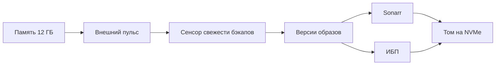

# Дорожная карта

Куда это хозяйство может расти дальше — и куда сознательно не растёт.

## Как читать

Дат здесь нет: домашний сервер живёт не по спринтам. Вместо сроков у каждого
пункта **повод** — событие, после которого браться за него имеет смысл.
Пока повода нет, пункт лежит и не мешает.

Оценки усилий условны: **S** — вечер, **M** — выходные, **L** — несколько
подходов с риском что-нибудь сломать.

---

## Что стоит сделать в первую очередь

Три вещи с наибольшей отдачей на вложенные усилия. Не потому что интересные,
а потому что закрывают настоящие дыры.

| | Что | Почему именно это | Усилия |
|---|---|---|---|
| 1 | [Внешний пульс](#внешний-пульс) | Сейчас падение самого NAS не заметит никто | S |
| 2 | [ИБП с USB](#ибп-с-usb) | Отключение питания на записи — это битый том и долгая проверка | S |
| 3 | [Зафиксировать версии образов](#версии-образов-вместо-latest) | `:latest` однажды принесёт breaking change ночью | M |

---

## Ближайшее — уже решено

- [ ] **Память 4 → 12 ГБ.** Планка 8 ГБ во второй слот. Обязательно ECC
      SODIMM: обычная отключит коррекцию ошибок на всём объёме, включая уже
      стоящие 4 ГБ. После установки — *Панель управления → Информационный
      центр → Тест памяти*, полный прогон.
      **Повод:** уже есть, планка куплена. **Усилия:** S.

- [ ] **Опубликовать репозиторий и включить GitHub Pages.**
      *Settings → Pages → Deploy from a branch → main → /docs*.
      **Усилия:** S.

- [ ] **Пройти оба чек-листа до конца.** Прогресс сохраняется в браузере,
      так что бросать и возвращаться можно спокойно.
      **Усилия:** M.

---

## Наблюдаемость

### Внешний пульс

- [ ] **Сообщение о том, что NAS лёг.**

      Сейчас в мониторинге есть логическая дыра: всё, что шлёт уведомления,
      работает на самом NAS. Упадёт контейнер — придёт сообщение. Отвалится
      индексатор — придёт. Выключится NAS целиком, потеряется питание,
      зависнет DSM — **не придёт ничего**, и узнаете вы об этом вечером,
      когда не откроется Jellyfin.

      Лечится это только снаружи. Home Assistant раз в пять минут дёргает
      внешний адрес, а сторонний сервис шлёт письмо, когда пинги прекратились.
      Подойдёт любой heartbeat-мониторинг с бесплатным тарифом; со стороны HA
      это один `rest_command` и одна автоматизация по расписанию.

      Учтите VPN: весь исходящий трафик NAS идёт в туннель, так что адрес
      пульса должен быть из него доступен — проверяется тем же `curl`,
      что и Пачка.

      **Повод:** есть прямо сейчас. **Усилия:** S.

- [ ] **Долговременные метрики без Grafana.**

      Home Assistant уже хранит почасовые агрегаты бессрочно — это отдельный
      механизм от recorder, и он почти ничего не стоит. Панель *Статистика*
      покажет температуру и загрузку за год, когда данные накопятся.
      Отдельная база и Grafana на двух ядрах R1600 того не стоят: см.
      [чего не делаем](#сознательно-не-делаем).

      **Повод:** через полгода накопленных данных. **Усилия:** S.

- [ ] **Присутствие дома.**

      Мобильное приложение Home Assistant плюс список устройств Keenetic
      дают достаточно точное «кто-то дома». Дальше — выключать телевизор
      при уходе, не будить его ночью, не слать уведомления о фильмах,
      когда никого нет.

      **Повод:** желание, чтобы дом реагировал на уход и возвращение.
      **Усилия:** M.

- [ ] **Второй наблюдатель, если появится второй хост.**

      Uptime Kuma или похожее имеет смысл только на отдельном железе —
      на том же NAS он не увидит падения этого NAS. Маленькая Raspberry Pi
      закрыла бы и это, и внешний пульс, и стала бы вторым DNS.

      **Повод:** появление второго устройства в доме. **Усилия:** M.

---

## Хранилище

### ИБП с USB

- [ ] **Корректное выключение при отключении питания.**

      Synology увидит ИБП сам, Home Assistant прочитает статус через
      интеграцию DSM. Даёт корректное завершение работы при отключении
      питания — то есть отсутствие битой файловой системы и потерянной
      базы. Для NAS с двумя дисками это не роскошь.

      **Повод:** первое моргание света, после которого пришлось ждать
      проверку тома. **Усилия:** S.

- [ ] **Том на NVMe для конфигураций и базы.**

      Два слота M.2 свободны. Перенос `/volume1/docker` на такой том убирает
      со шпинделей почти весь поток мелкой случайной записи: базу
      Home Assistant, метаданные Jellyfin, базы Radarr и Prowlarr.
      DSM 7.2+ умеет делать на M.2 полноценный том, а не только кэш —
      официально с накопителями Synology, для остальных есть скрипты
      сообщества.

      **Повод:** база HA перевалила за 2 ГБ или интерфейс стал заметно
      задумчивым. **Усилия:** L — переезд с остановкой всех контейнеров.

- [ ] **План замены дисков.**

      Synology DSM уже отдаёт в Home Assistant SMART-статус и остаточный
      ресурс каждого диска, а автоматизация шлёт 🔴 при любом отклонении
      от `normal`. Чего нет — решения, что делать дальше. Стоит заранее
      определить: при каком проценте ресурса заказываем замену, и лежит ли
      дома запасной диск.

      **Повод:** первое предупреждение SMART. **Усилия:** S — это решение,
      а не работа.

- [ ] **Расширение объёма.**

      Уведомление о заполнении тома на 85 % уже настроено. Варианты, когда
      оно придёт: диски большего объёма, отсек расширения DX525 или чистка
      библиотеки. Первый вариант на двухдисковом NAS означает долгую
      перестройку массива — планировать заранее.

      **Повод:** сообщение о 85 %. **Усилия:** L.

---

## Медиа-стек

- [ ] **Sonarr для сериалов.**

      Самое дешёвое расширение: структура папок под него уже заложена
      (`torrents/tv` и `media/tv` создаются одной командой), Prowlarr
      раздаст индексаторы автоматически, Seerr подхватит как второй сервер.
      Плюс один контейнер, около 300 МБ памяти.

      Не забыть: добавить в `docker.yaml`, в `WATCHED` внутри
      `docker_state.py`, в HTTP-проверки и на дашборд. Первые два поймает
      `test_список_по_умолчанию_совпадает_с_compose`: он сверяет надзор
      с обоими compose-файлами, так что забыть контейнер целиком не выйдет.
      HTTP-проверка в `monitoring.yaml` и карточка на дашборде остаются
      на совести человека.

      **Повод:** первое «хочу посмотреть сериал». **Усилия:** M.

- [ ] **Bazarr для субтитров.**

      Имеет смысл только если смотрите с субтитрами. Заодно снимет одну
      из причин транскодирования: заранее скачанный внешний файл `.srt`
      лучше, чем субтитры, вшитые в видеопоток.

      **Повод:** необходимость субтитров. **Усилия:** S.

- [ ] **Профили качества как код.**

      Recyclarr переносит рекомендованные профили и форматы TRaSH-guides
      в Radarr по конфигурационному файлу. Это ложится в репозиторий
      естественно — ещё один YAML под теми же проверками, и «почему скачалась
      именно эта раздача» перестаёт быть загадкой.

      **Повод:** когда надоест, что Radarr берёт не то. **Усилия:** M.

---

## Сеть

- [ ] **Резервный DNS на интерфейсе провайдера.**

      Технический долг, замеченный при разборе конфигурации: единственный
      сервер имён объявлен только на интерфейсе туннеля. Упадёт туннель —
      встанет разрешение имён во всей сети, включая телевизор и телефоны.
      Две команды, описаны в [заметках по роутеру](keenetic.md).

      **Повод:** есть прямо сейчас. **Усилия:** S.

- [ ] **Пересмотреть публикацию DSM наружу.**

      Панель управления NAS, доступная из интернета, — это сервис
      аутентификации, открытый всем. Безопаснее поднять WireGuard-сервер
      на самом Keenetic и ходить домой через него, а через KeenDNS
      публиковать только то, что действительно должно быть снаружи.

      **Повод:** первая запись в журнале DSM о неудачном входе с чужого
      адреса. **Усилия:** M.

- [ ] **Гостевой сегмент.**

      Два сегмента уже есть, механика понятна. Третий — для гостевого Wi-Fi,
      с доступом только в интернет. Гостям не нужно видеть ни NAS,
      ни телевизор.

      **Повод:** гости с ноутбуками. **Усилия:** S.

---

## Репозиторий и процесс

### Версии образов вместо `:latest`

- [ ] **Закрепить версии и обновляться осознанно.**

      Сейчас все восемь контейнеров на `:latest`. Это работает ровно до дня,
      когда `docker compose pull` принесёт мажорное обновление с изменённым
      форматом базы, и вы узнаете об этом по нерабочему Jellyfin в девять
      вечера. Особенно неприятно, если обновятся сразу несколько — искать
      виноватого придётся среди всех.

      Лечится закреплением тегов плюс Renovate или Dependabot: обновление
      приходит пул-реквестом, проверки прогоняются, вы читаете changelog
      и мержите когда готовы. Инфраструктура для этого уже есть — семь
      проверок в CI и `.github/dependabot.yml`, туда добавляется экосистема
      `docker-compose`.

      **Повод:** есть прямо сейчас. **Усилия:** M.

- [ ] **Проверка конфигурации настоящим Home Assistant.**

      Нынешние проверки разбирают YAML и компилируют шаблоны, но не знают,
      существует ли интеграция и верны ли имена ключей. Настоящую проверку
      делает `hass --script check_config` внутри официального образа.
      Мешает одно: без установленных компонентов HACS часть пакетов
      не загрузится. Обходится заглушками в `custom_components` — работа
      на пару вечеров, зато закрывает последний непокрытый класс ошибок.

      **Повод:** первый случай, когда конфигурация не загрузилась после
      обновления HA. **Усилия:** L.

- [ ] **Pre-commit хуки.**

      Те же проверки, что в CI, но до коммита. Экономят круг «запушил →
      подождал → упало → поправил». Пять строк конфигурации.

      **Повод:** третий раз, когда CI поймал то, что можно было увидеть
      локально. **Усилия:** S.

- [ ] **Сенсор свежести резервных копий.**

      Бэкапы настроены, но никто не проверяет, что они действительно
      создаются. Классика жанра — узнать об этом в момент восстановления.
      Достаточно `command_line`-сенсора на возраст самого свежего файла
      в `config/backups` и уведомления, если ему больше двух суток.

      **Повод:** есть прямо сейчас. **Усилия:** S.

---

## Сознательно не делаем

Не «когда-нибудь потом», а «решено не делать». Список нужен, чтобы через
полгода не проходить те же рассуждения заново.

**Аппаратное транскодирование.** У AMD Ryzen R1600 нет встроенной графики.
Включать нечего, никакая настройка Jellyfin этого не изменит. Стратегия
остаётся прежней: смотреть через приставку прямым воспроизведением,
транскод не запускать вовсе.

**Библиотека в 4K и HDR.** Матрица телевизора — 1366×768. Файл на 60 ГБ
отличается на этом экране от 1080p на 8 ГБ только занятым местом. Профиль
качества ограничен 1080p намеренно; пересматривать это имеет смысл только
вместе с телевизором.

**Kubernetes, Portainer, Swarm.** Восемь контейнеров на одном хосте.
Docker Compose с ними справляется, а любая оркестрация добавит слой,
который придётся обслуживать, не решив ни одной существующей задачи.

**Отдельная виртуальная машина с Home Assistant OS.** Дала бы Add-ons
и чуть более гладкие обновления, но отняла бы главное свойство нынешней
схемы: клон репозитория и есть рабочая конфигурация. Плюс 2–4 ГБ памяти
под гипервизор.

**Локальный доступ Алисы к Home Assistant.** Ускорил бы отклик на секунду-две
ценой дыры в изоляции сегментов. Колонка — устройство, которое слушает
комнату и обновляется само; ей незачем видеть домашнюю сеть.

**Grafana с отдельной базой метрик.** InfluxDB или VictoriaMetrics плюс
Grafana — это ещё два контейнера, гигабайт памяти и постоянная запись
на диски ради графиков, которые почти полностью закрывает встроенная
статистика Home Assistant. На двух ядрах R1600 цена несоразмерна.

**Раздача через VPN без проброса порта.** Входящие соединения через туннель
не приходят, рейтинг растёт медленно — это принято как данность. Городить
второй туннель ради раздачи не стоит; если у провайдера появится port
forwarding, включим его одной настройкой.

---

## Если захочется всё сразу

Порядок, в котором пункты не будут мешать друг другу:

Первые четыре шага — это вечер, вечер, вечер и одни выходные. После них
система перестаёт быть уязвимой к тихим отказам, и дальше можно расти
в удовольствие.
